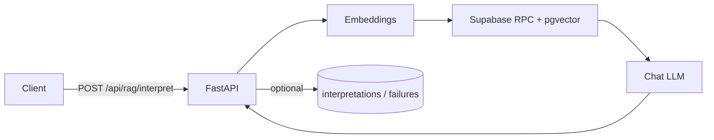

# Supabase RAG Worker

Config-driven **Retrieval-Augmented Generation** service: **FastAPI** + **Supabase (PostgREST + pgvector)** + pluggable **chat** providers (Gemini by default; optional OpenAI/DeepSeek fallbacks). Embeddings are implemented via **Gemini** in this repo; see `rag/embeddings.py` / `rag/gemini_client.py`.

The worker stays **domain-agnostic**: callers supply `project_id`, `task`, `text`, optional `metadata`, `docs_filters`, and `instructions`. Nothing in the code assumes pharmacies, tickets, or a specific CRM.

## How it works

1. Resolve **tenant config** from env vars: `{PREFIX}_VECTOR_RPC`, optional persistence tables, defaults.
2. **Embed** the query text (Gemini by default); optional `EMBEDDING_DIMENSION` check/truncation for pgvector compatibility.
3. Call your Postgres **RPC** (e.g. `match_documents`) with the embedding + filters — this is how pgvector search is exposed through Supabase.
4. **Build** a prompt from retrieved snippets + instructions + metadata.
5. **Complete** with `LLM_PROVIDER` (Gemini), with optional fallback when other provider keys are configured.
6. Optionally **persist** success rows / **failure** rows to tenant tables.



## Project layout

| Path | Role |
|------|------|
| `main.py` | FastAPI app, auth, `/api/rag/interpret` |
| `rag/config.py` | Global + per-project env loading; `project_id` → uppercase prefix |
| `rag/embeddings.py` | `generate_embedding` (Gemini/OpenAI providers) |
| `rag/llm.py` | Gemini + optional DeepSeek/OpenAI chat fallback |
| `rag/prompts.py` | Prompt assembly |
| `rag/retrieve.py` | `supabase.rpc(...)` wrapper + filter forwarding |
| `rag/service.py` | Orchestration + persistence hooks |
| `models/request.py` | Pydantic request/response models |
| `sql/example_match_documents.sql` | Example RPC you install in Supabase |
| `tests/test_rag.py` | Mocked unit tests (`pytest`) |

## Environment variables

### Global (worker)

| Variable | Required | Description |
|----------|----------|-------------|
| `SUPABASE_URL` | yes | Supabase project URL |
| `SUPABASE_SERVICE_KEY` | yes | Service role key (server only — never in browsers) |
| `WORKER_API_KEY` | no | If set, all requests must send `Authorization: Bearer <token>` |
| `EMBEDDING_PROVIDER` | no | `gemini` (default). Supported: `gemini`, `openai` |
| `EMBEDDING_MODEL` | no | Default `gemini-embedding-001` |
| `GEMINI_API_KEY` | yes* | *Required when using Gemini embeddings |
| `OPENAI_API_KEY` | yes* | *Required when using OpenAI embeddings |
| `EMBEDDING_DIMENSION` | no | If set, embedding length must match (catches model/table mismatch early) |
| `LLM_PROVIDER` | no | `gemini` (default); optional: `openai`, `deepseek` |
| `LLM_MODEL` | no | Primary chat model env (Gemini uses `GEMINI_LLM_MODEL`) |
| `LLM_TEMPERATURE` | no | Default `0.2` |
| `GEMINI_LLM_MODEL` | no | Default `gemini-3.1-flash-lite-preview` |
| `GEMINI_LLM_TEMPERATURE` | no | Default `0.2` |
| `DEEPSEEK_API_KEY` | no | DeepSeek (OpenAI-compatible) API key (optional fallback) |
| `DEEPSEEK_BASE_URL` | no | Default `https://api.deepseek.com` |
| `OPENAI_LLM_MODEL` | no | Used as OpenAI fallback when applicable (default `gpt-4o-mini`) |
| `DEEPSEEK_LLM_MODEL` | no | Used as DeepSeek fallback when applicable (default `deepseek-chat`) |
| `LOG_PII` | no | `true` to log prompt bodies (dev only) |
| `LOG_LEVEL` | no | e.g. `INFO`, `DEBUG` |

### Per tenant (`project_id` → uppercase prefix)

Example: JSON `project_id: "greatrx"` reads `GREATRX_*`.

| Variable | Required | Description |
|----------|----------|-------------|
| `{PREFIX}_VECTOR_RPC` | yes | PostgREST RPC name performing similarity search |
| `{PREFIX}_INTERPRETATIONS_TABLE` | no | If set, successful runs are inserted here |
| `{PREFIX}_FAILED_RUNS_TABLE` | no | If set, failures are recorded for retry/debug |
| `{PREFIX}_DEFAULT_INSTRUCTIONS` | no | Used when the request omits `instructions` |
| `{PREFIX}_DOCS_*` | no | Documentation / operator hints only (not used for SQL table name at runtime) |
| `{PREFIX}_WORKER_API_KEY` | no | If **global** `WORKER_API_KEY` is unset, this tenant can require its own bearer token |

**Auth rule:** If `WORKER_API_KEY` is set, it is required. Otherwise, if `{PREFIX}_WORKER_API_KEY` is set for that tenant, that bearer token is required. If neither is set, the endpoint is open (fine for local demos only).

## Supabase: RPC + tables

1. Apply `sql/example_match_documents.sql` in the SQL editor (adjust table name, columns, and `vector(N)` dimension).
2. Ensure the function parameter names match what the worker sends: at minimum `p_query_embedding`, `p_match_count`, `p_category`, `p_tags` (see `rag/retrieve.py`). Add more parameters in SQL and pass them via `docs_filters` using `p_*` keys or plain names (auto-prefixed with `p_`).
3. Set `{PREFIX}_VECTOR_RPC` to the function name (e.g. `match_documents`).

Suggested persistence schemas (align with `rag/service.py` inserts):

```sql
create table if not exists interpretations (
  id uuid primary key default gen_random_uuid(),
  task text,
  external_ref jsonb not null,
  interpretation text not null,
  metadata jsonb,
  docs_used jsonb,
  confidence double precision,
  model text,
  processing_time_ms int,
  created_at timestamptz not null default now()
);

create table if not exists interpretation_failures (
  id uuid primary key default gen_random_uuid(),
  task text,
  request_payload jsonb,
  error text,
  stage text,
  created_at timestamptz not null default now()
);
```

## API

### `POST /api/rag/interpret`

```json
{
  "project_id": "greatrx",
  "task": "interpret_ticket_group",
  "data": {
    "text": "Tickets about Lipitor shortage at Hollywood CVS...",
    "metadata": { "pharmacy_ids": [216, 220], "medication_id": 5 },
    "ticket_group_id": 123
  },
  "instructions": "Optional override for default instructions.",
  "docs_filters": {
    "category": "pharmacy_playbook",
    "tags": ["shortage", "lipitor"]
  },
  "match_count": 5
}
```

Response:

```json
{
  "interpretation": "...",
  "confidence": 0.87,
  "docs_used": [42],
  "processing_time_ms": 1200,
  "external_ref": {
    "metadata": { "pharmacy_ids": [216, 220], "medication_id": 5 },
    "ticket_group_id": 123
  },
  "model": "deepseek-chat"
}
```

`confidence` is derived from the maximum `similarity` value returned by your RPC when present; otherwise `null`.

### `POST /api/rag/run-interpret`

Loads all comments for an `issue_group_id` from `public.issue_group_comments` (configurable via env), concatenates them into the query text, then runs the **same** RAG + LLM path as `/api/rag/interpret` (still uses `knowledge_base` + `match_documents` for retrieval).

```json
{
  "project_id": "greatrx",
  "issue_group_id": 101,
  "task": "interpret_issue_group",
  "instructions": null,
  "docs_filters": { "category": "playbook", "tags": ["shortage"] },
  "match_count": 5
}
```

Database setup (one script): `sql/issue_groups_and_interpretations.sql`.

Optional env (defaults shown):

| Variable | Default |
|----------|---------|
| `{PREFIX}_ISSUE_GROUP_COMMENTS_TABLE` | `issue_group_comments` |
| `{PREFIX}_ISSUE_GROUP_ID_COLUMN` | `issue_group_id` |
| `{PREFIX}_COMMENT_BODY_COLUMN` | `body` |

Set `{PREFIX}_INTERPRETATIONS_TABLE` to a dedicated table (e.g. `interpretations`), **not** `knowledge_base`.

### `GET /health`

Returns `{ "status": "ok" }`.

## Local development

```bash
python3 -m venv .venv
source .venv/bin/activate
pip install -r requirements.txt
cp .env.example .env
# edit .env — include OPENAI_API_KEY, Supabase keys, and GREATRX_VECTOR_RPC, etc.
uvicorn main:app --reload --host 0.0.0.0 --port 8000
```

## One-time: backfill embeddings
Your `match_documents` RPC queries `public.knowledge_base.embedding`. If that column is `NULL`, retrieval will return no matches.

You can backfill embeddings in two ways:

1. A standalone script (one-time / offline)
2. An admin HTTP endpoint (incremental; call it whenever you add new rows)

### Script
To backfill embeddings for rows where `embedding IS NULL`:

```bash
. .venv/bin/activate
export SUPABASE_URL=...
export SUPABASE_SERVICE_KEY=...
export EMBEDDING_PROVIDER=gemini
export EMBEDDING_MODEL=gemini-embedding-001
export EMBEDDING_DIMENSION=1536

python scripts/backfill_embeddings.py
```

Optional env vars:
- `EMBEDDINGS_TABLE` (default `knowledge_base`)
- `EMBEDDINGS_CONTENT_COLUMN` (default `content`)
- `EMBEDDINGS_EMBEDDING_COLUMN` (default `embedding`)
- `EMBEDDINGS_BACKFILL_BATCH_SIZE` (default `50`)
- `EMBEDDINGS_SLEEP_SECONDS` (default `0.0`)

### Admin endpoint (recommended)
`POST /api/ops/backfill-embeddings`

This endpoint computes embeddings for rows where `embedding_column IS NULL` and writes them back. It is incremental: once a row has an embedding, it is skipped.

Request body:

```json
{
  "project_id": "greatrx",
  "limit": 100,
  "batch_size": 50,
  "sleep_seconds": 0.0,
  "dry_run": false,
  "table": "knowledge_base",
  "content_column": "content",
  "embedding_column": "embedding"
}
```

Notes:
- `table` / `content_column` / `embedding_column` are optional; if omitted, the worker uses tenant env config (`{PREFIX}_DOCS_TABLE`, `{PREFIX}_DOCS_CONTENT_COLUMN`, `{PREFIX}_DOCS_EMBEDDING_COLUMN`) and otherwise defaults to `knowledge_base` / `content` / `embedding`.
- The endpoint uses the same embedding provider/model as `/api/rag/interpret` (your Gemini settings, in Gemini-only mode).

With [Railway CLI](https://docs.railway.app/develop/cli) linked to a project:

```bash
railway run uvicorn main:app --host 0.0.0.0 --port 8000
```

Tests:

```bash
pytest -q
```

## Railway deployment

1. Create a new **Railway** service from this repo (GitHub or `railway up`).
2. Set **Variables** to match `.env.example` (Supabase URL/key, model keys, `{PREFIX}_VECTOR_RPC`, optional tables).
3. Railway sets `PORT`; `Procfile` uses uvicorn on `0.0.0.0`.
4. `runtime.txt` requests Python 3.11.x (Nixpacks/Heroku-style builders honor it; if your builder ignores it, set Python 3.11 in the platform UI).


be sure to not be in a legacy geo. if it wont change, log out and log back in
## Extending

- **Another LLM:** add a branch in `rag/llm.py` (or small provider modules) using the same OpenAI-compatible message shape.
- **Another embedding model:** implement a new provider in `rag/embeddings.py` and set `EMBEDDING_PROVIDER` + dimension checks.
- **Stricter security:** keep the service behind your backend only; rotate `SUPABASE_SERVICE_KEY`; use `WORKER_API_KEY` or per-tenant keys in production.

## License

MIT (add a `LICENSE` file if you publish as OSS).
